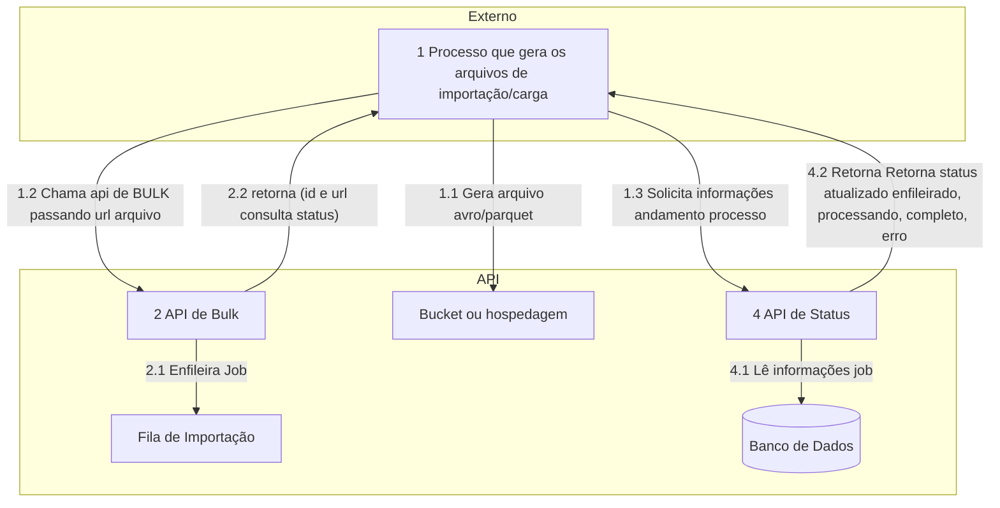

## Processo de ingestão de dados via Bulk Api

### Big Picture

[Desenho inical C4](https://drive.google.com/file/d/19Yg6AWwLcIwO05uDiTbF7zPSUEcWa3sR/view?ts=66be4d15)





### Exportação de dados

1. Os arquivos de exportação terão formato definido para cada figura [(Exemplos)](#exemplos);

1. Os dados deverão ser transformados para o formato parquet e carregados em algum armazenamento, tal como o **S3** ou similar, utilizando-se de url segura ou token.

    > 1. será preciso fornecer algum endpoint de **upload de documentos**, para o caso de uso dos clientes que usam a api de bulk diretamente.

1. A url do arquivo armazenado será submetida a Api de Bulk referente a figura ao qual se deseja importar.

> É possível converter arquivos json para parquet e restaurá-los para json. Por padrão os subníveis são convertidos como uma coluna do tipo json, conforme abaixo:


> Em um processo de importação isso não seria problemático, pois as linguagem geralmente possuem mecanimos de lidar com json, tal como python. Existem soluções que permitem lidar com parquet diretamente no postgres, que já tem suporte a tranformar json em rows para manipulações, mas não foram feitos testes acerca do segundo.

### Apis de importação

As apis de bulk irão receber a url do arquivo, enfileirar e devolver uma URL de status para a conferência do andamento/conclusão do processo.

As apis de Bulk seguem o padrão:

>  **PUT** figura/_bulk ->  Para registro do arquivo de importação.

>  **GET** figura/_bulk/status/{id} ->Para consulta do andamento do processo.

<a href="fornecedores_bulk_api.md" target="_blank">Documentação apis</a>

### Worker

Componente responsável por processar os arquivos. Consiste em:

1. Ler o trabalho na fila;
1. Efetuar o download do arquivo;
1. Processar os dados atualizando os registros de status;

    * Será preciso definir um tamanho máximo para o arquivo na api, pois existem limitações/custo de tamanho de volume para o processo de download e processamento.

    * Uma outra solução seria carregar os dados diretamente do bucket para o postgres usando o **Copy** (Descrito [neste artigo](https://docs.aws.amazon.com/pt_br/AmazonRDS/latest/UserGuide/USER_PostgreSQL.S3Import.html) ) para uma tabela de **STAGE**, similar o quer ocorre com o **SYM_DATA**, e manipular por lá usando **[Merge](https://www.postgresql.org/docs/current/sql-merge.html)**.

    * Outar hipótese seria paginar em lotes e efetuar as importações de forma paralelizada.(Divide o trabalho entre o banco e aplicação ou alguma ferramenta que efetue trabalho de processamento, tal como NIFI);


### Exemplos

* <a href="../lista_fornecedores.json" target="_blank">Lista de Fornecedores (exemplo de arquivo de entrada antes da conversão para parquet).</a>

* <a href="../.exporta.py" target="_blank">Exemplo da conversão de json para parquet.</a>


* <a href="../.worker.py#L176" target="_blank">Exemplo do worker de processamento dos dados para postgres.</a>

*  Exemplo tabela "stage"

```sql
create table stage_area(
    id uuid default uuid_generate_v4() primary key,
    batch uuid default uuid generate_v4(),
    created_time timestamp default current_timestamp,
    updated_time timestamp default current_timestamp,
    schema_name text not null,
    table_name text not null,
    columns text not null,
    data text not null,
    status text default 'RD',
    status_message text
);

/*
Status possíveis
RD - READY - Pronto para carregamento/em espera
SK - SKIPED - Ignorado por escolha
LD - LOADING -  Em estado de carregamento
ER - ERROR - Erro qualquer, detalhado em status_message
OK - Processado com sucesso
*/
```

* Exemplo merge linha a linha

> https://www.postgresql.org/docs/current/sql-merge.html

** (postgres 15 em diante)

```sql
MERGE INTO ns.pessoas AS dest
USING (VALUES
  ('a92708e1-a7bc-4162-98b4-a2b8a2152407'::uuid, '300202', 'KING PRODUCOES E EVENTOS LTDA (alteardo merge)', true::int, true::int, true::int,'I'),
  ('ff9a0a8d-a7d3-48d6-8623-6dc6d69859bb', '300202', 'KING PRODUCOES E EVENTOS LTDA (alteardo merge)', true::int, true::int, true::int, 'D')
) AS orig (id, pessoa, nome, fornecedorativado, vendedorativado, fichaativado, op)
ON dest.id = orig.id
WHEN MATCHED AND orig.op <>'D' /*orig.id IS NOT NULL*/ THEN
    UPDATE SET
        id = orig.id,
        pessoa = orig.pessoa,
        nome = orig.nome,
        fornecedorativado = orig.fornecedorativado,
        vendedorativado = orig.vendedorativado,
        fichaativado = orig.fichaativado
WHEN NOT MATCHED /*--AND orig.id IS NOT NULL*/ THEN
    INSERT (id, pessoa, nome, fornecedorativado, vendedorativado, fichaativado)
    VALUES (orig.id, orig.pessoa, orig.nome, orig.fornecedorativado, orig.vendedorativado, orig.fichaativado)
WHEN MATCHED AND orig.op ='D' /*orig.id IS NULL*/ THEN
    DELETE;
```