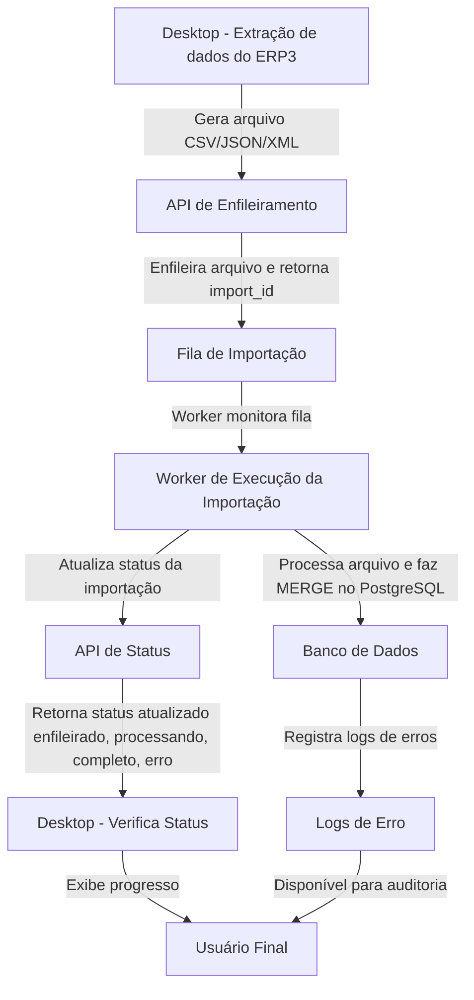
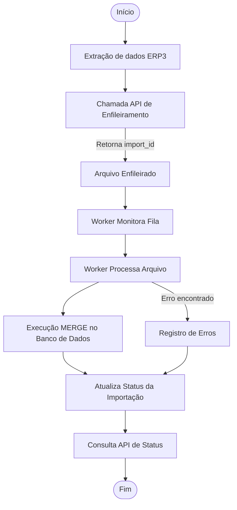
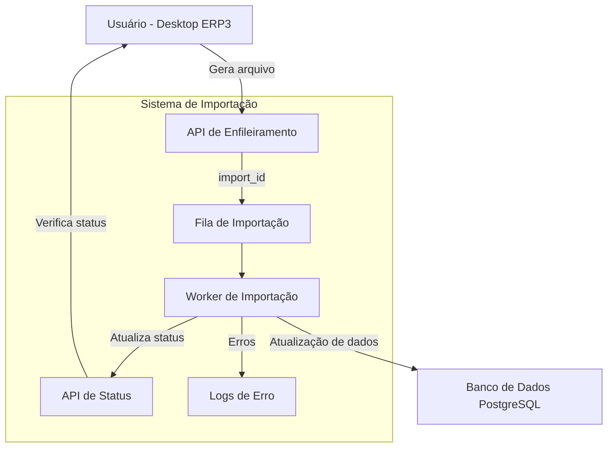
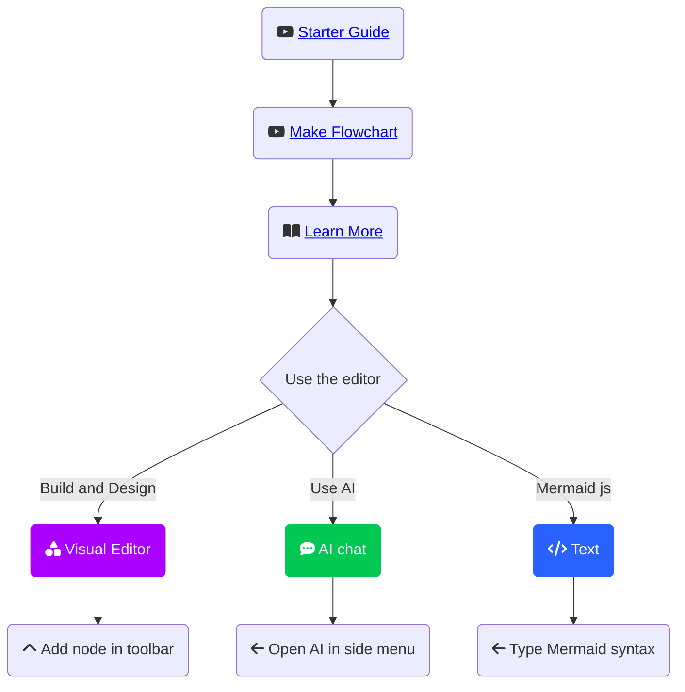

# Exportação de dados

# Apis de importação

``` mermaid
graph TD
    A[Desktop - Extração de dados do ERP3] -->|Gera arquivo CSV/JSON/XML| B[API de Enfileiramento]
    B -->|Enfileira arquivo e retorna import_id| C[Fila de Importação]
    C -->|Worker monitora fila| D[Worker de Execução da Importação]
    D -->|Processa arquivo e faz MERGE no PostgreSQL| E[Banco de Dados]
    D -->|Atualiza status da importação| F[API de Status]
    F -->|Retorna status atualizado enfileirado, processando, completo, erro| G[Desktop - Verifica Status]
    E -->|Registra logs de erros| H[Logs de Erro]

    G -->|Exibe progresso| I[Usuário Final]
    H -->|Disponível para auditoria| I
```

```mermaid
flowchart TD
    start([Início]) --> extract[Extração de dados ERP3]
    extract --> queueAPI[Chamada API de Enfileiramento]
    queueAPI --> |Retorna import_id| enqueued[Arquivo Enfileirado]
    enqueued --> workerMonitors[Worker Monitora Fila]
    workerMonitors --> processFile[Worker Processa Arquivo]
    processFile --> mergeDB[Execução MERGE no Banco de Dados]
    mergeDB --> updateStatus[Atualiza Status da Importação]
    updateStatus --> checkStatus[Consulta API de Status]
    checkStatus -->
    //end([Fim])

    processFile -->|Erro encontrado| logError[Registro de Erros]
    logError --> updateStatus
```

```mermaid
graph TD
    A[Usuário - Desktop ERP3] -->|Gera arquivo| B[API de Enfileiramento]
    B -->|import_id| C[Fila de Importação]
    C --> D[Worker de Importação]
    D -->|Atualização de dados| E[Banco de Dados PostgreSQL]
    D -->|Atualiza status| F[API de Status]
    F -->|Verifica status| A
    D -->|Erros| G[Logs de Erro]

    subgraph Sistema de Importação
        B
        C
        D
        F
        G
    end
```

```mermaid
graph TD
    A[Usuário - Desktop ERP3] -->|Gera arquivo| B[API de Enfileiramento]
    B -->|import_id| C[Fila de Importação]
    C --> D[Worker de Importação]
    D -->|Atualização de dados| E[Banco de Dados PostgreSQL]
    D -->|Atualiza status| F[API de Status]
    F -->|Verifica status| A
    D -->|Erros| G[Logs de Erro]

    subgraph Sistema de Importação
        B
        C
        D
        F
        G
    end

```

```mermaid
flowchart TD
%% Nodes
    A("fab:fa-youtube <a rel="noopener" href="https://www.youtube.com/watch?v=T5Zthq-QR2A&amp" target="_blank">Starter Guide</a>")
    B("fab:fa-youtube <a rel="noopener" href="https://www.youtube.com/watch?v=rfQ_yGJ8QAQ&amp" target="_blank">Make Flowchart</a>")
    C("fa:fa-book-open <a rel="noopener" href="https://mermaid.js.org/syntax/flowchart.html" target="_blank">Learn More</a>")
    D{"Use the editor"}
    E(fa:fa-shapes Visual Editor)
    F("fa:fa-chevron-up Add node in toolbar")
    G("fa:fa-comment-dots AI chat")
    H("fa:fa-arrow-left Open AI in side menu")
    I("fa:fa-code Text")
    J(fa:fa-arrow-left Type Mermaid syntax)

%% Edge connections between nodes
    A --> B --> C --> D -- Build and Design --> E --> F
    D -- Use AI --> G --> H
    D -- Mermaid js --> I --> J

%% Individual node styling. Try the visual editor toolbar for easier styling!
    style E color:#FFFFFF, fill:#AA00FF, stroke:#AA00FF
    style G color:#FFFFFF, stroke:#00C853, fill:#00C853
    style I color:#FFFFFF, stroke:#2962FF, fill:#2962FF

%% You can add notes with two "%" signs in a row!
```