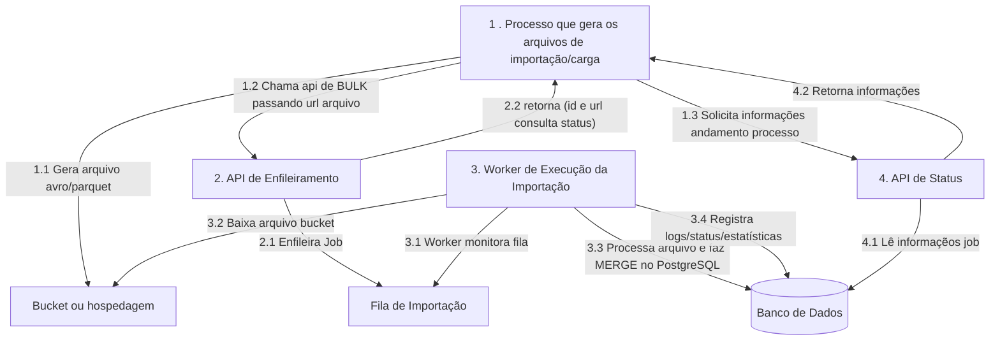
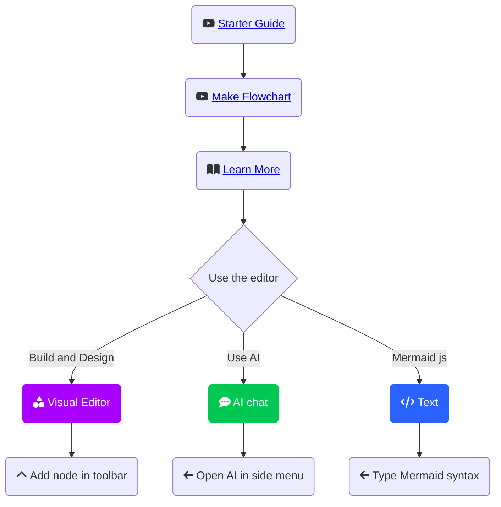

## Processo de ingestão de dados via Bulk Api

### Big Picture

https://drive.google.com/file/d/19Yg6AWwLcIwO05uDiTbF7zPSUEcWa3sR/view?ts=66be4d15

    subgraph API/ Wolker
        API_ENF
        QUEUE_IMP
        API_STATS
        WORKER
        BUCKET
        BDWEB
    end
    subgraph Externo
        CLIENT
    end

#### Exportação de dados

#### Apis de importação

#### Worker

